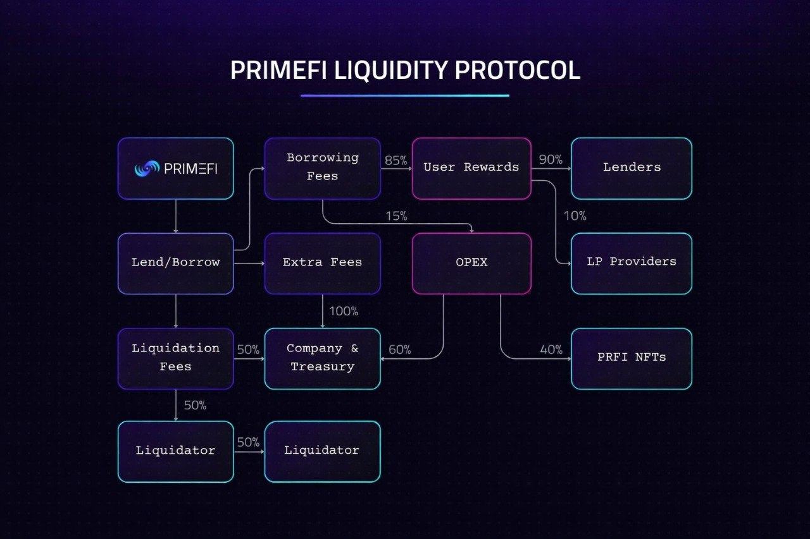

# Hyperswap

<figure><figcaption></figcaption></figure>

**About HyperSwap**\
HyperSwap is a decentralized exchange (DEX) designed to provide seamless and efficient token swaps within the HyperEVM ecosystem. As the native liquidity hub for HyperEVM, HyperSwap facilitates trustless, permissionless trading with minimal slippage and deep liquidity. Built on advanced automated market maker (AMM) technology, HyperSwap ensures that users experience fast, efficient, and cost-effective transactions.

The platform supports various liquidity pools, enabling users to provide liquidity and earn fees while enhancing the overall trading experience. By eliminating intermediaries, HyperSwap enhances security, transparency, and decentralization, making it a critical component of the HyperEVM ecosystem.

***

**Integration with PrimeFi**\
PrimeFi has successfully integrated HyperSwap into its decentralized lending and borrowing ecosystem, enabling seamless swaps of PRFI tokens from the moment of its Token Generation Event (TGE). This integration ensures that PRFI holders have instant liquidity and access to a wide range of trading pairs on HyperSwap.

By leveraging HyperSwap’s robust infrastructure, PrimeFi enhances its DeFi capabilities, offering users efficient asset management and a smooth trading experience. The integration also reinforces PrimeFi’s commitment to providing a frictionless omnichain financial ecosystem.

***

**Benefits for PrimeFi Users**\
The integration of HyperSwap into PrimeFi provides several advantages:

* **Instant Liquidity:** PRFI holders can trade seamlessly on HyperSwap without relying on centralized exchanges.
* **Low Fees and Efficiency:** The AMM model ensures cost-effective transactions with minimal slippage.
* **Enhanced Security:** As a decentralized exchange, HyperSwap offers trustless trading without intermediaries.
* **Liquidity Provision Rewards:** Users can contribute to liquidity pools and earn passive income through trading fees.
* **Seamless DeFi Experience:** PrimeFi users benefit from easy access to swaps, lending, and borrowing in one ecosystem.

***

**Future and Trust**\
PrimeFi is dedicated to building a fully interconnected DeFi ecosystem, and the integration with HyperSwap marks a key step in this journey. By ensuring seamless token swaps, improved liquidity, and a user-centric trading experience, PrimeFi strengthens its position as a leading omnichain lending and borrowing protocol.

As HyperSwap continues to evolve and expand its offerings, PrimeFi remains committed to leveraging its technology to enhance the DeFi experience for its users. The partnership underscores the vision of a more accessible, efficient, and decentralized financial future powered by blockchain innovation.
