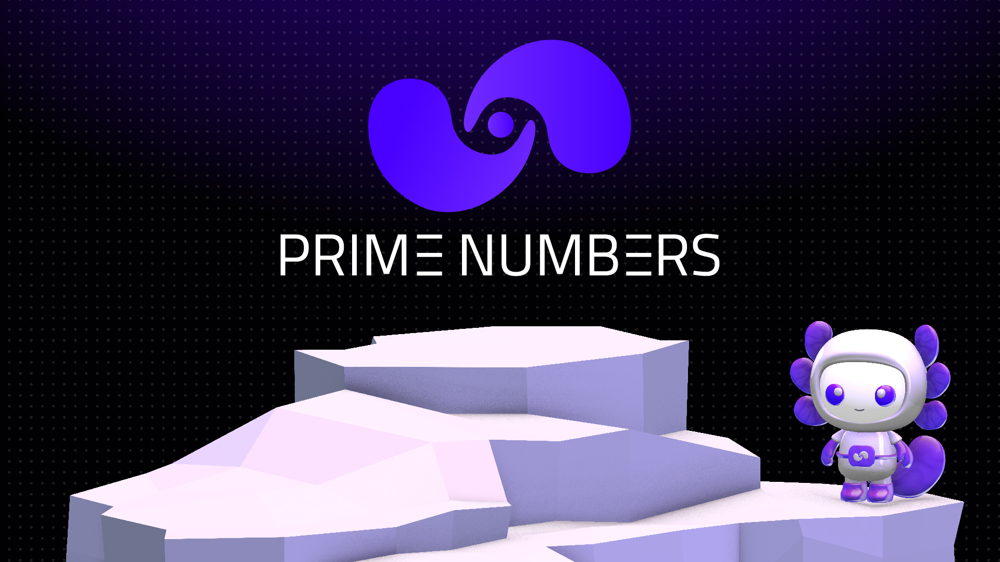

# What is Prime Numbers

<figure><figcaption></figcaption></figure>

Prime Numbers is a decentralized finance ecosystem built on XDC Network\
and expanded across Hyperliquid, Base, and Ethereum. It consists of three\
live, audited protocols, PrimeFi, PrimeStaking, and PrimePort, unified\
by the $PRFI token.

Each protocol serves a distinct function: PrimeFi handles omnichain lending\
and borrowing, PrimeStaking manages liquid staking and yield, and PrimePort\
provides the NFT marketplace infrastructure. Together they form a closed-loop\
ecosystem where fees, liquidity, and rewards flow between protocols and back\
to $PRFI holders.

$10M+ in deployed TVL. Six audited contracts. Four chains. Live since 2021.
