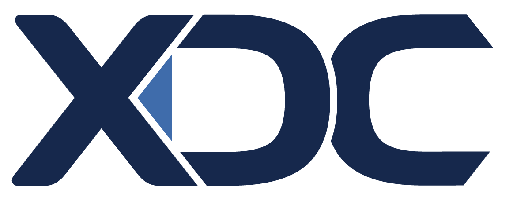

# Deep Dive

\ <mark style="color:purple;">**Partnership Between XDC Network and Prime Numbers Labs**</mark>

<figure><figcaption></figcaption></figure>

In the ever-evolving world of blockchain and cryptocurrency, partnerships are pivotal for growth, innovation, and expansion. One significant partnership occurred earlier this year between the XDC Network and Prime Numbers Labs. Here's a detailed look into this collaboration:

**Genesis of the Partnership:** Prime Numbers Labs' unwavering dedication and innovative strides in the crypto space caught the attention of the XDC Network. Prime Numbers Labs' strategic move to Dubai marked the beginning of this collaboration, which facilitated a series of meetings between the two entities. Recognizing the mutual benefits and shared vision, they decided to forge a partnership.

**Mutual Benefits and Collaboration:** The partnership is characterized by mutual support and collaboration:

1. **Support from XDC to Prime Numbers Labs:**
   * **Contacts:** XDC Network's vast network will provide Prime Numbers Labs with valuable contacts that can further their objectives.
   * **Events:** Prime Numbers Labs will have access to events organized or associated with the XDC Network, enhancing their visibility and outreach.
   * **Funds:** Financial support from XDC will bolster Prime Numbers Labs' projects and initiatives.
   * **Development:** XDC will assist Prime Numbers Labs in various developmental aspects, ensuring they have the resources and expertise needed.
2. **Contribution of Prime Numbers Labs to XDC:**
   * **Expertise in Public Blockchains:** With over eight years of experience in the crypto domain, Prime Numbers Labs brings its expertise, especially in the public part of blockchains, to the table.
   * **Network of Connections:** Prime Numbers Labs boasts a vast network of connections, which can be leveraged to enhance the prominence and reach of the XDC Network.

**A Testament to the Partnership:** As a testament to the depth and significance of this partnership, Arturo, the founder of Prime Numbers Labs, was inducted as a core team member of the XDC Network. This move solidifies the collaboration and ensures that both entities work closely, leveraging each other's strengths for mutual growth.

In conclusion, the partnership between XDC Network and Prime Numbers Labs is a testament to the power of collaboration in the crypto space. With shared goals and complementary strengths, both entities are poised for significant future achievements and innovations.

***

#### <mark style="color:purple;">**WHY XDC NETWORK?**</mark>

The XDC Network is a hybrid blockchain (public/private) that combines the benefits of both ledgers and offers services to businesses and institutions.

The open-source protocol software uses a Delegated Proof of Stake (XDPoS) consensus mechanism and is compatible with EVM. It enables fast transactions (2000TPS), interoperability, and cybersecurity.

XDC works on interbank solutions and financial services related to Trade Finance, ISO 20022, and R3 Corda.

In this manner, their blockchain's relationships with the private finance sector are robust, while at the same time, they have a public network with exceptional capabilities.

***

### <mark style="color:purple;">Private Sector in XDC Network</mark>

#### <mark style="color:purple;">**Trade Finance**</mark>

This is XDC's core activity through the private blockchain ledger. It allows real-time global trade and financing using blockchain for investors, governments, and institutions.



#### <mark style="color:purple;">**Team**</mark>

The XDC team comprises experts in blockchain, finance, and technology, with high-level experience in finance companies.

The platform also has partnerships with companies such as IBM, Oracle, and the government of India.

#### <mark style="color:purple;">**André Casterman - Advisor**</mark>

With a career spanning over 20 years at SWIFT and technological innovations in payment systems, he has successfully led XDC Network to be selected to join the TFD Initiative.

#### <mark style="color:purple;">**Key Partners: R3 Corda and Impel**</mark>

Both leverage the XDC network, providing decentralization and instant transactions to their applications and messaging.

#### <mark style="color:purple;">**XDC offers enterprise solutions such as:**</mark>

1. ISO 20022 API Solution
2. Cross-chain bridge capabilities
3. Regulated Stablecoins
4. Custodial Solutions for digital assets
5. Corporate-to-bank payments and trade finance flows
6. Compliance Solutions



***

### <mark style="color:purple;">Latest Developments</mark>

XDC Network has continued to expand its institutional and global footprint:

* **Japan Expansion**\
  Partnership with SBI VC Trade (SBI Group), enabling XDC trading, staking, and deeper integration into the Japanese financial market :contentReference\[oaicite:0]{index=0}
* **Real-World Asset Tokenization**\
  Continued growth in tokenized finance, including trade finance assets and compliant financial instruments such as tokenized US Treasuries and structured products :contentReference\[oaicite:1]{index=1}
* **Institutional Adoption**\
  Increasing integration with regulated financial products, investment platforms, and enterprise infrastructure, positioning XDC as a bridge between traditional finance and blockchain :contentReference\[oaicite:2]{index=2}
* **Protocol Upgrades**\
  Launch of **XDC 2.0 (2025)**, improving smart contract capabilities and cross-chain interoperability :contentReference\[oaicite:3]{index=3}

***

### <mark style="color:purple;">Ecosystem Contribution</mark>

Prime Numbers has developed the full public DeFi stack on XDC, including:

* Liquid staking
* Lending and borrowing (PrimeFi)
* NFT marketplace (PrimePort)
* Omnichain integrations (LayerZero, Stargate, Etherscan)
* Validator infrastructure

***

### <mark style="color:purple;">Final Perspective</mark>

XDC Network is a leading infrastructure layer in:

* Trade Finance
* Real-World Asset (RWA) tokenization
* ISO 20022-compliant financial systems

Its positioning at the intersection of **institutional finance and blockchain** gives it strong long-term relevance, especially as tokenization and regulated DeFi adoption continue to grow.

***

### <mark style="color:purple;">Learn More</mark>

→ https://xdc.network
