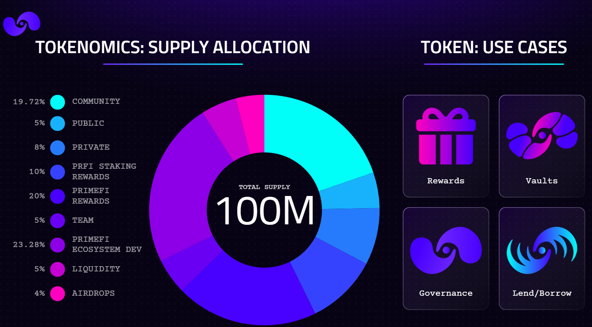

---
layout:
  title:
    visible: true
  description:
    visible: false
  tableOfContents:
    visible: true
  outline:
    visible: true
  pagination:
    visible: true
---

# Ecosystem Fees - to do

<figure><figcaption></figcaption></figure>

***

We are going to explain how the generated fees/funds are distributed in the Prime Numbers Labs Ecosystem:

## <mark style="color:purple;">Primeport NFT Marketplace</mark>

Primeport charges a 1.5% fee on all secondary sales. The following graph shows how this fee is distributed.&#x20;

Primeport also charges a 5% fee on all projects that use PrimePort Drops. This fee goes to the company treasury.

<figure><figcaption></figcaption></figure>

***

## <mark style="color:purple;">PrimeFi Liquidity Protocol</mark>

PrimeFi has different types of fees:

* Borrowing Fees: These fees are variable depending on the crypto asset and are distributed between the Users, Company, PRFI NFTs.
* Liquidation Fees: A 15% fee applies to a liquidation event; the reward is split between the liquidator and the protocol.
* Extra Fees: Penalty fees go to the treasury.

<figure><figcaption></figcaption></figure>

***

## <mark style="color:purple;">PRFI NFTs</mark>

PRFI NFTs receive rewards from staking, primeport, and prime finance. \
Learn more here: [PRFI NFTs](nft-staking-reward-system-to-do/prfi-staking-nfts/)

<figure><figcaption></figcaption></figure>

***

## <mark style="color:purple;">XDC NFTs</mark>

XDC NFTs receive rewards from  XDC Masternodes. \
Learn more here: [XDC NFTs](prime-numbers-xdc-ecosystem/xdc-staking-nfts/)

<figure><figcaption></figcaption></figure>
