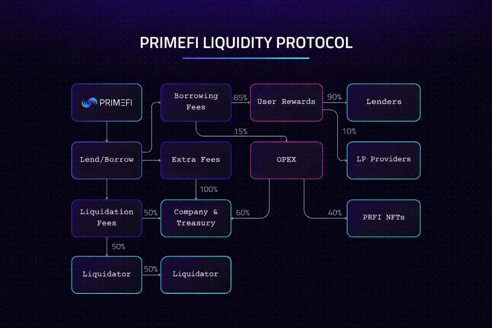

# PrimeFi Liquidity Protocol

[PrimeFi](https://docs.primefi.xyz/) has different types of fees:

* Borrowing Fees: These fees are variable depending on the crypto asset and are distributed between the Users, Company, PRFI NFTs.
* Liquidation Fees: A 15% fee applies to a liquidation event; the reward is split between the liquidator and the protocol.
* Extra Fees: Penalty fees go to the treasury.

<figure><figcaption></figcaption></figure>
